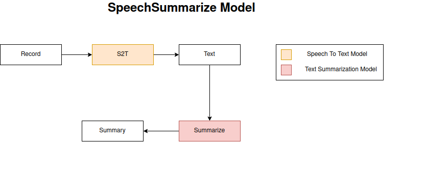
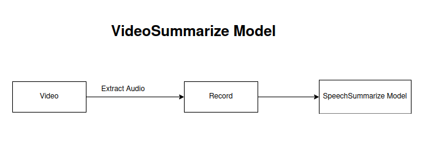
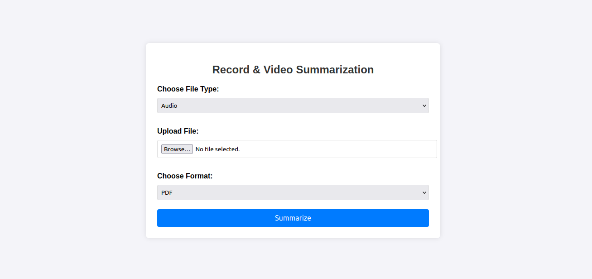

# Record & Video Summarization
- This project demonstrates a workflow for converting audio recordings or videos into text using  
  OpenAI's Whisper model and then summarizing the transcribed text using a fine-tuned GPT-2 model. The workflow is designed to efficiently handle audio and video content, transforming it into summarized text, which can then be saved in various formats based on user preference.

### Workflow

1. **Audio/Video to Text Conversion**:
   - **Model**: OpenAI's Whisper
   - **Purpose**: Converts audio recordings or videos into transcribed text.

2. **Text Summarization**:
   - **Model**: Fine-tuned GPT-2
   - **Purpose**: Generates a concise summary of the transcribed text.

3. **Summary Output**:
   - **Formats Available**:
     - PDF
     - Word Document (.docx)
     - PowerPoint Presentation (.pptx)
     - Plain Text (.txt)

### Features

- **Transcription**: Automatically converts spoken content from audio or video files into text.
- **Summarization**: Produces a summary of the transcribed text using a GPT-2 model fine-tuned for this purpose.
- **Flexible Output**: Choose to save the summary in your preferred format, including PDF, Word, PowerPoint, or plain text.




## Project 


## Requirements

- Python 3.7 or higher
- Transformers library
- PyTorch
- FASTAPI
- jinja2
- Additional dependencies (as listed in `requirements.txt`)

## Installation
1. Clone this repository:
   ```bash
   git clone https://github.com/Shymaa2611/SpeechSummarization_API.git
   cd SpeechSummarization_API
   pip install -r requirements.txt
   uvicorn main:app --reload
   ```

## Usage 
- Open: http://127.0.0.1:8000/


## API Endpoints
- Open : http://127.0.0.1:8000/docs
